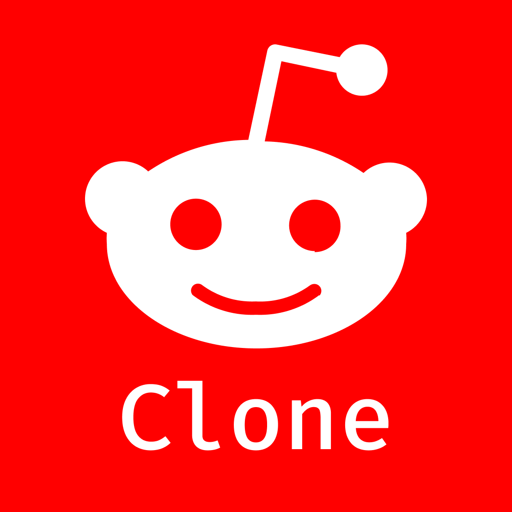
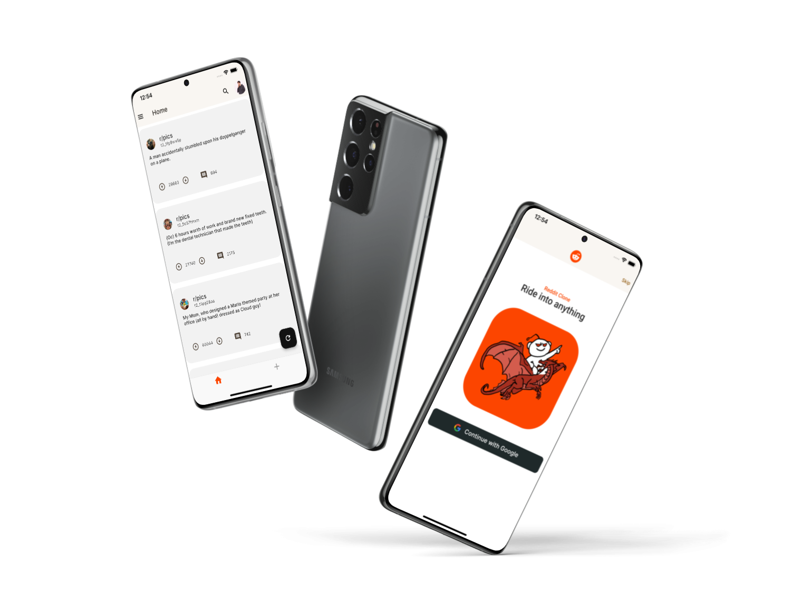

# flutter-reddit-clone


<!-- PROJECT LOGO -->
<br />
<div align="center">
  <a href="">
    
  </a>

  <h3 align="center">Reddit Clone App - Flutter</h3>

  <p align="center">
    A simple reddit clone app that works on Android and iOS with one single codebase.
    <br />
    
</div>

   <br />
<div align="center">

</div>
   <br />
<!-- ABOUT THE PROJECT -->

## About The Project


These project was build as a challenge during the interview process of a Flutter Developer position. The idea was simple: build a Reddit mobile clone that uses a specific API to get the subreddits.


### Built With
* [Flutter](https://flutter.dev/)
* [Firebase](https://firebase.google.com/)
* [Subreddit Api](https://api.reddit.com/r/pics/hot.json)

<br>

<!-- GETTING STARTED -->
## Getting Started
The app was made specially for iOS and Android devices. No testing was donde for web.
To use the mobile version you need to have at least one of this installed:
 * VsCode
 * Xcode
 * Android Studio

 and be able to run the app on an emulator or real device.


### Installation with Flutter

1. Go to your favorite IDE and clone the repo:


2. To be able to use Flutter, you should install it on your computer. 

   Folow this link for guidelines: https://docs.flutter.dev/get-started/install

3. Once you have Flutter SDK installed, go to the repository root and enter:

   ```sh
   flutter pub get
   ```

   This will get all the project dependencies.


4. Select an emulator or real device to install the app into and run: 
   ```sh
   flutter run
   ```
   The app should take a few minutes to install and run.

## Features

The app is very simple, with only a few features: 
- Login Screen with Google Sign In
- Home Screen with two drawers (community and profile) that shows the feed or posts requested from the API
- Bottom nav bar to change from Home to Add Post Screen (to be implemented)
- Theme mode toggle (dark to light) 


## Dependencies 
The packages used in this project where as follows:
* 
- State Management: [Riverpod](https://pub.dev/packages/riverpod)
- Api Request: [Dio](https://pub.dev/packages/dio)
- Sign In: [Google Sign In](https://pub.dev/packages/google_sign_in)
- Authentication: [Firebase Auth](https://pub.dev/packages/firebase_auth)
- Storage: [Cloud Firestore](https://pub.dev/packages/cloud_firestore)

<br>

## Environment Setup
To create different environments (dev, stg, prod) a flavor approach was used. A launch.json file was created so the different environments could be launch from VSCode. At this point in time, the app is only available on dev environment.

   <br>
   launch.json: 
   
   ```sh
   {
    "configurations": [
    {
        "name": "Launch development",
        "request": "launch",
        "type":"dart",
        "program": "lib/main_development.dart",
        "args": [
            "--flavor",
            "development",
            "--target",
            "lib/main_development.dart"
        ]
    },
     {
        "name": "Launch staging",
        "request": "launch",
        "type":"dart",
        "program": "lib/main_staging.dart",
        "args": [
            "--flavor",
            "staging",
            "--target",
            "lib/main_staging.dart"
        ]
    },
    {
        "name": "Launch production",
        "request": "launch",
        "type":"dart",
        "program": "lib/main_production.dart",
        "args": [
            "--flavor",
            "production",
            "--target",
            "lib/main_production.dart"
        ]
    }
    ]
}
   ```
   After this, the application could be launched either on Development, Staging or Production. 
   
